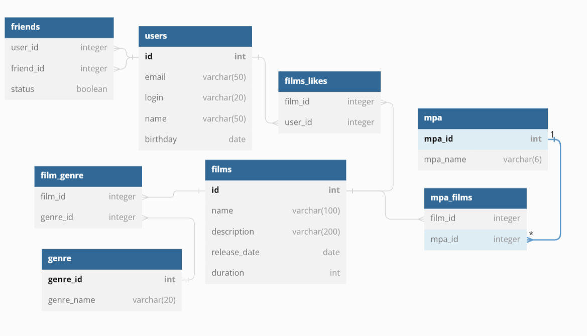

# java-filmorate
Данный проект представляет из себя агрегатор фильмографии, который позволяет получать информацию о фильмах и пользователях ресурса.
Приложение позволяет:

Добавить новый фильм на ресурс.
Удалить фильм.
Поставить оценку(лайк) фильму.
Обновить информацию о фильме.
Получить список всех фильмов.
Получить список фильмов по определенным критериям (фильтрам).
Информация о фильмах включает:
название;
жанр;
рейтинг;
описание;
дату выпуска;
продолжительность.
Зарегистрировать пользователя на ресурсе.
Удалить пользователя
Обновить информацию пользователя ресурса.
Добавить другого пользователя в друзья.
Удалить пользователя из списка друзей.
Получить список всех пользователей ресурса.
Получить список пользователей по определенным критериям (фильтрам).
Информация о пользователях включает:
email;
логин;
имя;
фамилию;
дату рождения.
Получить список друзей пользователя.
Посмотреть список общих друзей пользователей.
Посмотреть статус дружбы между двумя пользователями.

## Endpoints

### Films
- `[GET] /films` – получить список всех фильмов
- `[GET] /films/{id}` – получить фильм `id`
- `[POST] /films` – создать новый фильм
- `[PUT] /films` – обновить фильм
- `[GET] /films/popular` – получить топ 10 самых популярных фильмов
- `[GET] /films/popular?count={count}` – получить топ `count` самых популярных фильмов
- `[PUT] /films/{id}/like/{userId}` – поставить лайк фильму `id` от пользователя `userId`
- `[DELETE] /films/{id}/like/{userId}` – удалить лайк у фильма `id` от пользователя `userId`

### Users
- `[GET] /users` – получить список всех пользователей
- `[GET] /users/{id}` – получить пользователя `id`
- `[POST] /users` – создать нового пользователя
- `[PUT] /users` – обновить пользователя
- `[PUT] /users/{id}/friends/{friendId}` – добавить пользователю `id` в друзья пользователя `friendId`
- `[DELETE] /users/{id}/friends/{friendId}` – удалить у пользователя `id` из друзей пользователя `friendId`
- `[GET] /users/{id}/friends` – получить список всех друзей пользователя `id`
- `[GET] /users/{id}/friends/common/{otherId}` – получить список общих друзей пользователей `id` и `otherId`

### Mpa
- `[GET] /mpa` – получить список всех возрастных рейтингов
- `[GET] /mpa/{id}` – получить возрастной рейтинг `id`

### Genres
- `[GET] /genres` – получить список всех жанров
- `[GET] /genres/{id}` – получить жанр `id`

## Схема базы данных

